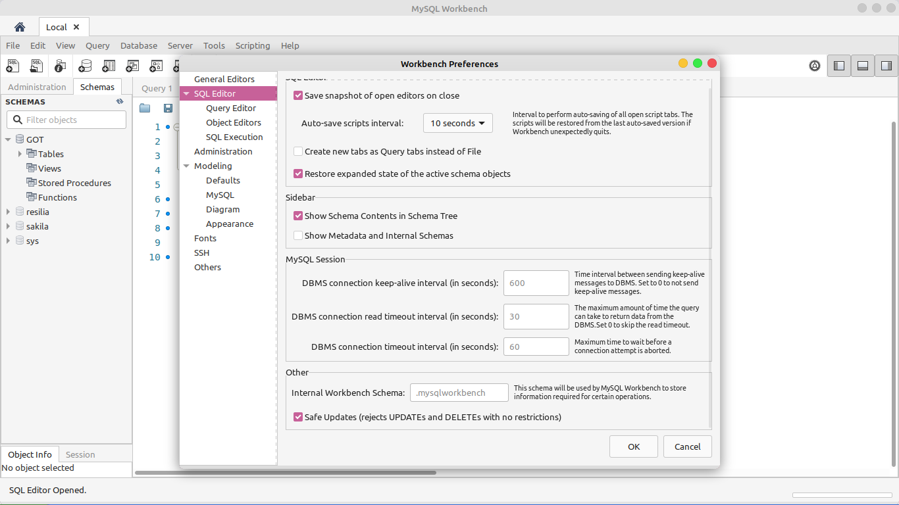

## SQL DATABASE COMANDOS 

Oii, fiz esse compiladinho de comandos SQL para me ajudar em consultas rápidas. 

Fique a vontade pra me enviar sugestões e acréscimos de comandos :)

Esta ainda não é sua versão final, pretendo colocar aqui tudinho que eu aprender sobre banco de dados :) 

## Comandos básicos 

* Criar Banco de Dados

  ```sql
  CREATE DATABASE `NOME_DATABASE`
  ```

  

*  Usar Banco de Dados

  ```sql
  USE `NOME_DATABASE`
  ```

  

* Criar tabela 

  ```sql
  CREATE TABLE `NOME_TABELA` (ID INT); //
  
  -- exemplo maior:
  CREATE TABLE `alunos` (
    `id` int PRIMARY KEY,
    `nome` varchar(100),
    `cpf` varchar(15),
    `turma` int
  );
  ```

  

* Inserir valores dentro de uma tabela 

  ```sql
  INSERT INTO `NOME_TABELA` VALUES(VALORES A SEREM INSERIDOS, SEPARADOS POR VIRGULA)
  
  -- EX: 
  INSERT INTO alunos VALUES(30, 'Jaiane Guimarães', '111.222.333-45', 2)
  ```

  

* Mostrar a 'descrição' da tabela, ou seja, quais são seus atributos e os seus tipos 

  ```sql
  DESC `NOME_TABELA`
  ```

  

* Selecionar, ou seja, exibir os dados de uma tabela (o * significa todos, os seja, vai mostrar todos os dados da tabela )

  ```sql
  SELECT * FROM `NOME_TABELA`
  ```

  

* Iniciar uma transação

  ```sql
  START TRANSACTION 
  ```

  

* Commitar as alterações 

  ```sql
  COMMIT
  ```

  

* Retornar a alteração anterior, feita antes de dar o commit 

  ```sql
  ROLLBACK
  ```

  

## Comandos de alteração 

* Alterar a tabela adicionando um novo atributo 

  ```sql
  ALTER TABLE `NOME_TABELA` ADD `NOME_ATRIBUTO` TIPO(TAMANHO)
   EX: ALTER TABLE `ALUNOS` ADD `TURMA` VARCHAR(2) 
  ```

  

* Alterar a tabela removendo um atributo 

  ```sql
  ALTER TABLE `NOME_TABELA` DROP `NOME_ATRIBUTO`
  ```

  

* Atualizar o valor de um atributo

  ```sql
  UPDATE `NOME_TABELA` SET `NOME_ATRIBUTO` = "VALOR" WHERE `ID` = ID
  -- EX:
  UPDATE `ALUNOS` SET `TURMA` = "2B" WHERE `NOME` = 'Jaiane'
  
  -- é possivel alterar vários valores de uma só fez, pra isso é só fazer:
  
  UPDATE `ALUNOS` SET `TURMA` = '1'  -- agora TODOS os alunos são da turma 1
  
  -- para atualizar valores sem especificação, ou seja, sem o where, é necessário que você desative o safe update, no finalzinho tem um print  mostrando como faz :)
  ```

  

  

* Limpar todos os valores de uma tabela 

  ```sql
  TRUNCATE TABLE `NOME_TABELA`
  ```

* Apagar dados específicos de uma tabela 

  ```sql
  DELETE FROM `NOME_TABELA` WHERE `ID` = 1
  ```

  


## Comandos de Criação 

* Criar um banco de dados 

  ```sql
  CREATE DATABASE `NOME_DATABASE`
  ```

  

* Criar um banco de dados SE ELE NÃO EXISTIR 

  ```sql
  CREATE DATABASE IF NOT EXISTS `NOME_TABELA`
  ```

  


### Como desabilitar o safe update?

Vá em Edit, clique em preferências e desmarque a ultíma opção -> Safe Updates (rejects UPDATEs and DELETEs with no restriction)



