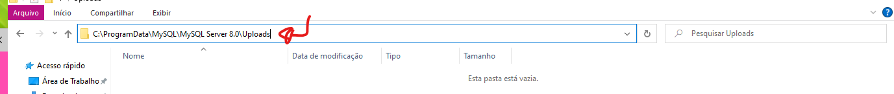

# Como importar tabelas csv pelo Terminal / MYSQL

Tutorial completinho em 5 passos de como importar tabelas no formato csv pelo terminal - no Windows


Vamos lá:

### 1º Passo:

Primeiro você precisa abrir o mySQL Server no seu terminal, para isso vá até a pasta em que o arquivo executável do mySQL Server se encontra.

No meu computador ela se encontra nesse caminho:

```C:\Program Files\MySQL\MySQL Server 8.0\bin ```


Acredito que na maioria dos computadores windows também se encontre nesse caminho.

Caso o seu também, cole no seu prompt de comando:

```bash
cd C:\Program Files\MySQL\MySQL Server 8.0\bin
```

Caso não, procure onde esse arquivo se encontra e abra o seu terminal nessa pasta. Você pode baixar o Windows Terminal(um ótimo aplicativo de terminal que você pode baixar na Microsoft store) que da a opção de você abrir a pasta diretamente no terminal:

A pasta deve ser parecida com esta:


### 2º Passo 

Show, feito isso seu terminal deve estar parecido com isso: certo?


Agora você vai iniciar o mySQL Server e habilitar a importação de arquivos 'locais' no servidor, que por padrão vem desabilitado.

Digite no seu terminal:

```bash
mysql --local-infile=1 -u root -p
```

Muita atenção aqui, pois se você  não entender o que está acontecendo pode te atrasar bastante.

o **root** é o seu usuário, é o nome que você salvou pra entrar no mysql workbench, que se você não mudou, o nome será root mesmo.

Depois ele pedirá uma senha, essa é a senha que você criou, mas acho que ainda não usou, quando a gente cria a nossa conta no mySQL, fazemos duas senhas, lembra? Uma que usamos sempre que abrimos o workbench e outra que ainda não usamos, é agora que você vai usa-lá. 

(Essa é uma parte que eu não tenho certeza, mas por via das dúvidas, é só testar as duas senhas, não custa nada e será rapidinho rs)


### 3º Passo


--- Galerinha, nem tudo eu sei explicar, mas confia na mãe:

Vá no seu prompt e digite:

```bash
SHOW GLOBAL VARIABLES LIKE 'local_infile';
```


Ele vai retornar:


E então execute esse comando no terminal para mudar esse valor para **ON**

```bash
SET GLOBAL local_infile = true;
```


### 4 º Passo

#### Essa é uma etapa extensa, mas só precisa ser feito uma vez

Agora a gente já poderia passar direto pra etapa da importação, porém quero prevenir vocês de um provável problema que só aconteceria na  hora de importar.

Pelo o que eu entendi, o mySQL vem configurado com uma pasta específica que tem permissão para fazer essas importações, o seu arquivo deveria estar dentro dela senão, não será possível importar. 

Então, para poder usar arquivos de qualquer pasta do seu computador siga essas passos:

##### Digite no seu prompt:

```bash
SHOW VARIABLES LIKE  "secure_file_priv";
```

E retornará algo assim: certo?


Copie esse endereço do Value: **C:\ProgramData\MySQL\MySQL Server 8.0\Uploads\ **

e cole na barra de pesquisa seu explorador de arquivos:




Essa pasta está vazia, saia dela indo para MySQL Server 8.0


Agora clique no arquivo **my** , nós iremos editar esse arquivo. 

Eu utilizo o VsCode, então clico com o botão direito e vou em **abrir com o Code**

Com o arquivo aberto no VsCode, ou no editor de texto que vc preferir, pressione **CTRL + F**

e procure pela palavra **secure**


Algo assim deve aparecer, certo?

Agora **apague esse caminho e deixe somente** 

```bash
secure-file-priv = ""
```


Agora salve,

**para salvar esse arquivo você precisa estar como *administrador*, o próprio VsCode irá te dar a opção de tentar salvar como *administrador*.**


Depois de salvo, vá em **Serviços**, **procure por MySQL80** (no caso o meu é o 8.0, mas será a versão que vc baixou, ok?) e clique em **reiniciar**


### 5º Passo 

Se você rodar

```bash
SHOW VARIABLES LIKE  "secure_file_priv";
```

e ele retornar: 


Significa que agora está tudo certo e podemos prosseguir para a importação!


No prompt de comando faça:

```sql
LOAD DATA INFILE 'C:/nome da sua pasta/seuArquivo.csv'
INTO TABLE nome_tabela
FIELDS TERMINATED BY ',' -- depende do seu arquivo
LINES TERMINATED BY '\n' -- depende do seu arquivo
IGNORE 1 ROWS;
```

*aconselho colocar a pasta dentro do disco local, da menos chance de dar erro para encontrar a pasta.*


**ATENÇÃO!!!11** 

```
As barras que separam as pastas devem ser '/' e não '\'
correto: C:/testando/testando1/teste.csv
errado: C:\testando\testando1\teste.csv
```


```sql
FIELDS TERMINATED BY -- é a maneira que os campos são separados, então os campos são separados por virgula
-- geralmente um arquivo csv é:
nome,idade,turma
Jaiane 20 t10
```

```sql
LINES TERMINATED BY -- é como cada valor de cada campo é separado dos demais 
-- nesse exemplo os valores estão separados por um espaço.
nome,idade,turma 
Jaiane 20 t10


```


```
se a separação for:
um espaço use: ... TERMINATED BY '\n'
um tab:TERMINATED BY '\t'
os dois? : TERMINATED BY '\n\t'
```


(eu não achei muita informação que me ajudasse sobre o terminated by, caso tenha mais informações e queira contribuir, por favor, não hesite de adicionar uma sugestão)


